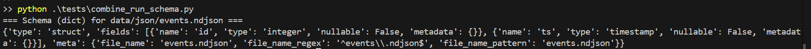
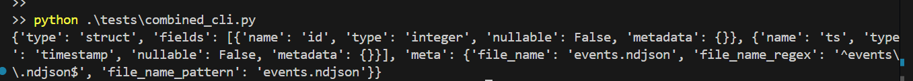

# schema-classifier-test-cases
This repository is to test the use cases for schema-classifier python library


```bash

## To set up this repository, create and activate venv
python -m venv .venv
source .venv/bin/activate 
or 
.\.venv\Scripts\activate

python.exe -m pip install --upgrade pip
pip install -r requiremements.txt

```

```bash

## To test the command thru API. Below is the snippet for output for dict format and schema files are in api folder
python tests\combine_run_schema.py

```



```bash

## To test the command thru CLI. Below is the snippet for output for dict format and schema files are in cli folder
python tests\combined_cli.py

```
